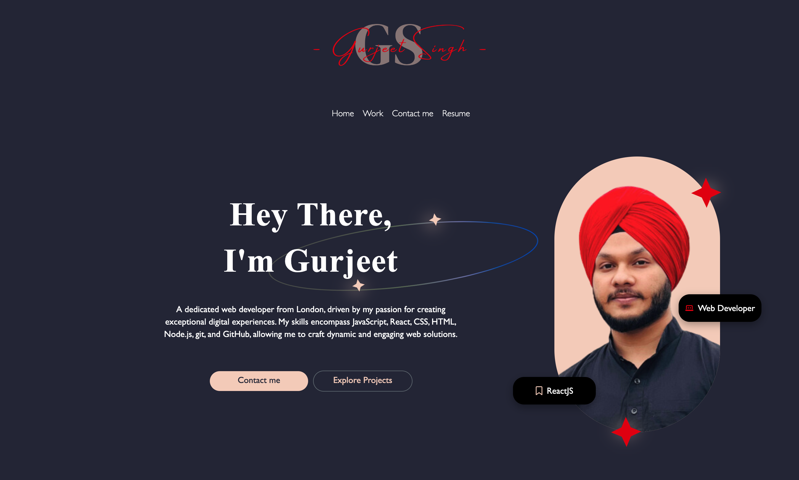
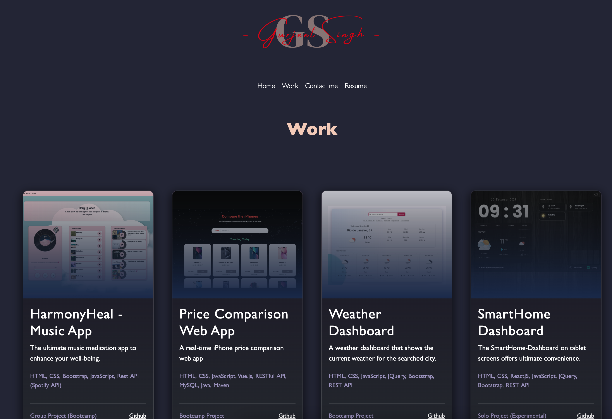
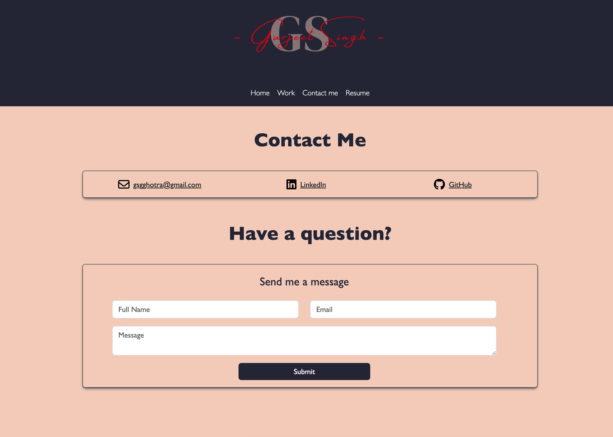

# Gurjeet's Portfolio

Welcome to my portfolio! This README file provides an overview of the contents of my portfolio and how to navigate it.
- **Visit** my portfolio at: https://portfolio-gurjeet.netlify.app/

## Table of Contents

1. [Introduction](#introduction)
2. [Screenshots](#screenshots)
3. [Projects](#projects)
4. [Contact Information](#contact-information)

## Introduction

I am a passionate and experienced web developer. With a strong foundation in web technologies, a creative mindset, and a commitment to delivering exceptional user experiences, I bring digital ideas to life. I am constantly seeking new opportunities to learn and collaborate, so please feel free to reach out if you're interested in working together.

## Screenshots
- **Hero Section**:

- **Work Section**:

- **Contact Section**:

## Projects

### Project 1: Project Management Website

- **Description**: Versety is a project and deadline management website originally conceived as a time management solution for university assignments and deadlines. The project's inception was driven by the need for a comprehensive tool to help students efficiently manage their academic commitments and reminders in their Emails.

- **Technologies Used**: PHP, HTML, CSS, JavaScript and SQL
- **Code**: [Github/Versety](https://github.com/gsgghotra/Versety-Project_management)

### Project 2: Mobile Phone Store

- **Description**: This project, developed as part of my academic assignment, aimed to create an informative website tailored for a local mobile store. The primary objective was to provide users with a platform to access up-to-date information on mobile phone prices with sim contract options. The project successfully met all user requirements, which included implementing a functional contact form with validation.

- **Technologies Used**: HTML, CSS, JavaScript 
- **Visit** the website at [Tru-Say Phones](https://gsgghotra.github.io/Tru-Say-Phones/)
- **Code**: [Github/Tru-Say-Phones](https://github.com/gsgghotra/Tru-Say-Phones)

## Contact Information

- **Email**: gsgghotra@gmail.com
- **LinkedIn**: [gsgghotra](https://www.linkedin.com/in/gsgghotra/)

Feel free to reach out to me via email or connect with me on LinkedIn. I'm always open to new opportunities, collaborations, or just a friendly chat!
